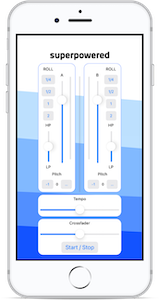
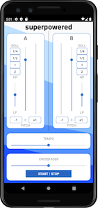
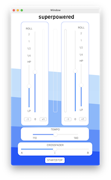
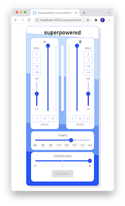

# Universal application demonstration

To demonstrate the ease of cross platform development with Superpowered, we've created a demo application that runs identically on Web, iPhone, MacOS and Android. You'll be pleasantly surprised that the C++ Superpowered API code can be shared across all native platforms and how only the language specific syntax changes are required when writing the same application in the browser.








> Remember, Superpowered applications output **identical** audio, regardless of platform.

The application demonstrates the following functionality

* Loading and decoding audio - local file for native, remote assets for web.
* Correctly controlling the audio thread from the UI
* Audio analysis at multiple points in the audio chain and real-time metering
* Independent pitch-shifting and time-stretching
* Tempo locked beat repeats
* High-pass and low-pass filter implementation
* Summing signals and general audio processing chains

Besides the use of Superpowered or even the fact its an audio application, this collection of applications might also be an interesting way to learn how to develop the same ideas across platforms.

---

## Interactive example

Visit the repo's Github page [here](https://splice.github.io/superpowered-universal-app/).

Want to see it running on other platforms? Download this repository and get building! We decided not to included the compiled executables due to the complexities around code signing and installation.

---

## Platforms supported and design decisions

We wanted to keep the code as clean as possible and focus on the audio code so made the following decisions around the languages which we chose to implement the applications in and any external dependencies required.

| Platform | Language | Additional libraries |
|---|-----------|----|
| iOS | Swift 5 | - |
| Android | Java  | VerticalSlider |
| MacOS | Objective-C  | - |
| Web | Javascript/React| MaterialUI |

> At the beginning of this project, we fully intended to share the Swift code across iOS and macOS, but due to fundamental performance issues when running swift on macOS, we decided to craft a standalone Objective-C implementation for macOS. As swift support improves over time, the Objective-C codebase will hopefully become redundant. For those who are interested, the UI responsiveness is terrible when running Swift code on macOS, if you you have any insight please let us know by raising an issue on this repository.

### What about Windows?

Windows **is** supported by Superpowered and the Universal App for Windows is coming. We've setup a handy guide for **exactly** that with our [Integration guide for Windows](https://docs.superpowered.com/getting-started/how-to-integrate/windows).

### What about Linux?

Linux was deliberately not included as a target in this demonstration application due to the complexities around rendering the UI. We explored the use of [QT](https://switchboard-sdk.github.io/), but decided it was beyond the scope of this demonstration as it meant writing a lot of external library code which distracts from the game at play. However, we must stress, Linux **is** supported by Superpowered. You'll want to take a look at out OpenSource wrappers that abstract some of the complexities with getting a DSP processing chain up off the ground with the various audio architectures on Linux. We've setup a handy guide for **exactly** that with our [Integration guide for Linux](https://docs.superpowered.com/getting-started/how-to-integrate/linux).

## Shared codebase

Superpowered is a cross platform C++ and WebAssembly audio SDK library which allows you to use the same API across all platforms. For native platforms, we can easily share the C++ audio code (with some small bridges to our implementation language). On Javascript, we can duplicate the C++ classes using the same Superpowered API calls, but just written in Javascript to be executed by the WebAssembly version of the library. You'll get near native performance with the use of the WebAssembly Superpowered library.

## Application structure

Below is a very top level overview of the application's code structure

```
-------------------------    -------------------------
| MixerChannel class     |  |   MixerChannel class    |  (There are two channels in this mixer example)
-------------------------    -------------------------
                    |           |
                    |           |
            -------------------------
            |   MixerEngine class   |  (Co-ordinates the mixer channels)
            -------------------------
                        |
                        |
                        |
                        |                    --------------------------
                        |                    |           UI           | (Native UI for OSs, React for Web)
                        |                    |  (Platform dependent)  |
                        |                    --------------------------
                        |                       |
                        |                       |
                        |                       |
                    --------------------------------
                    | Application controller       |   (Written in various languages)
                    --------------------------------
                                |
                                |
            --------------------------------------------
            | Superpowered open-source audio scheduler |   (Provides an audio processing callback with a common interface)
            --------------------------------------------
                                |
                                |
            --------------------------------------------
            |          Operating System or Browser      |
            --------------------------------------------
                                |
                                |
            --------------------------------------------
            |                Audio device               |
            --------------------------------------------
```

### MixerChannel class

The MixerChannel class is responsible for the generation of an individual isolated mixer channels. A new MixerChannel is instantiated for the two channel mixer, but it could of course be extended to any many as you might need.

This class contains the following Superpowered tools

* Advanced Audio Player - The source of the audio
* Roll FX
* 2 x Filter FX
* Volume utility

The class includes the following methods used for controlling the audio output of the channel

* togglePlay(isMaster)
* process(buffer, numberOfFrames)
* setVolume(float newVolume)
* getPeak()
* getPitchShift()
* setPitchShift(newValue)
* getIsLoaded()
* configure(originalBPM, firstBeatMs)
* getCurrentBPM()
* setSyncToBPM(bpm)
* setFilterFrequencyPosition(newValue)
* setRollEnabled(beats)
* setRollDisabled()

The javascript implementation has an additional method to load async audio

* loadBuffer(buffer, assetDefinition)

See the [C++](https://switchboard-sdk.github.io/superpowered-universal-app/) and [Javascript](https://switchboard-sdk.github.io/superpowered-universal-app/) of the MixerChannel class

### MixerEngine class

The MixerEngine class is responsible for creating the required number of MixerChannel instances and centrally controlling them. We also take peak reading of the sum individual MixerChannels buffers and then sum them together for our master output.

This class contains the following Superpowered tools

* StereoMixer

The class includes the following methods

* togglePlay()
* getPeak();
* setCrossFaderPosition(float newValue);
* setTempo(float newValue);
* process(float *buffer, unsigned int numberOfFrames);

* setChannelVolume(int channel, float newVolume);
* getChannelPeak(int channel);
* getChannelPitchShift(int channel);
* setChannelPitchShift(int channel, int newValue);
* setChannelFilterFrequencyPosition(int channel, float newValue);
* setChannelRollEnabled(int channel, float beats);
* setChannelRollDisable(int channel);

See the [C++](https://switchboard-sdk.github.io/superpowered-universal-app/) and [Javascript](https://switchboard-sdk.github.io/superpowered-universal-app/) of the MixerEngine class

## Hooking it all up

We encourage you to take a look at the code to how Superpowered is wired in on the various platforms. You'll also find the [Superpowered guides](https://docs.superpowered.com/guides) over on the documentation is useful, as it goes through in detail how to use the library. Take a look at the [Superpowered API reference](https://docs.superpowered.com/reference/latest) to see what classes are available with interactive audio examples to quickly demonstrate how Superpowered's DSP sounds.

You might also want to take a look at the [Getting Started guide](https://docs.superpowered.com/geting-started) to see how Superpowered can be efficiently wired into the various platforms.


### Naive

We're using Superpowered's open-source audio subsystem wrappers to schedule calls from the audio thread to our controllers which are in turn calling the processblock of the MixerEngine. Please take a look at the various examples to see how this is wired in. Rest assured, its quite easy to do.

We're using the native UI libraries for each platforms which explains why they all look **slightly** different.

### Web

When we're on the web Superpowered runs in WebAssembly, which operates with a dedicated audio thread via `AudioWorklets`. `AudioWorklets` sit on top of the `WebAudio API`, which schedules the processBlocks for us. In the example app, we import and use our MixerChannel and MixerEngine classes in our `AudioWorkletProcessorScript`. Please see the worker script [here](https://switchboard-sdk.github.io/superpowered-universal-app/) to see how we've wired it up.


## Running the code

### Native

We've written the application with the following IDE and environments, you'll need at least the versions we used.

| Platform | Required environment |
|---|-----------|
| iOS | Xcode 13 |
| Android | Android Studio Arctic Fox 2020  |
| MacOS | Xcode 13  |
| Web | Node + NPM |


### Web

You can run the web version locally and experiment with the code by running the following commands

```shell
# Downlaod this repo
git clone https://switchboard-sdk.github.io/superpowered-universal-app superpowered-universal-app

# Go into the javascript directory
cd superpowered-universal-app/javascript

# Install dependencies
yarn

# Start local dev server
yarn start
```


## Conclusion

We encourage you to try out the various applications and use our code example as he basis of your next cross platform audio application. Try our web demo on various browsers and devices to see how it performs.

If you'd like to develop blazing fast audio applications with none of the complexities, then the [Superpowered documentation](https://docs.superpowered.com) site will be your best friend. Take a look to find

* Superpowered API Reference
* Getting Started guides
* Boilerplate code repositories
* **More** Superpowered example applications
* Interactive audio examples of each DSP class

Enjoy!
